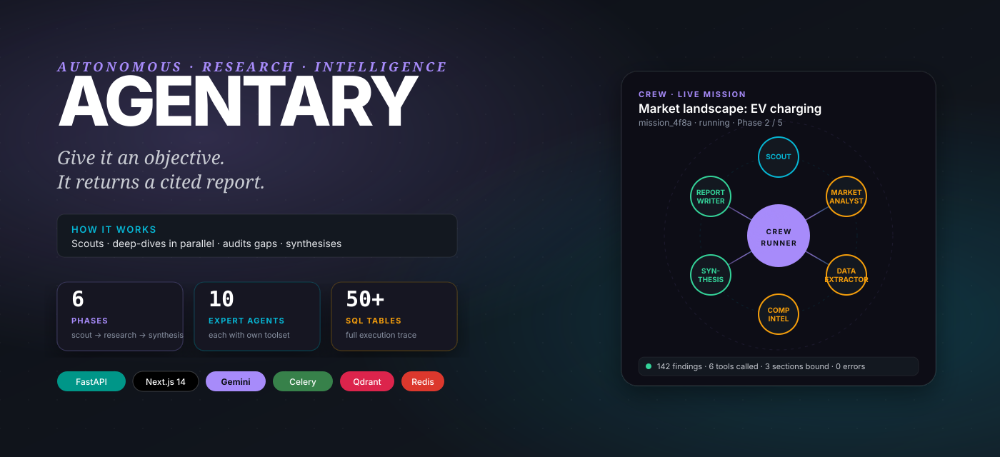
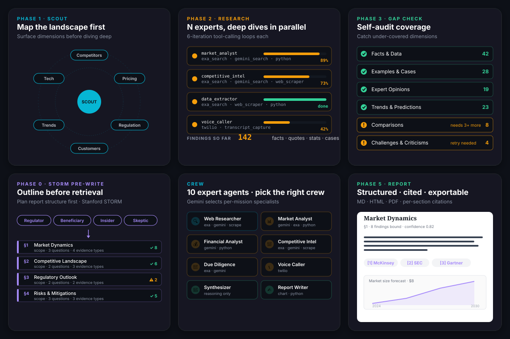
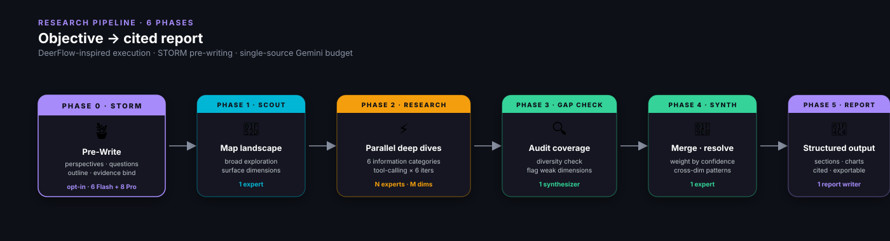
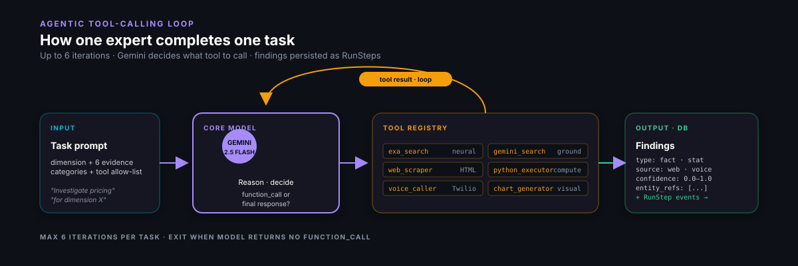
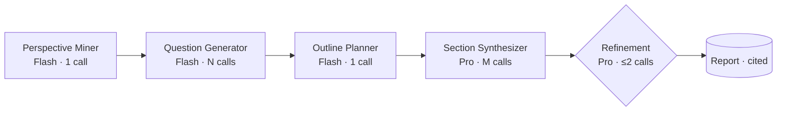
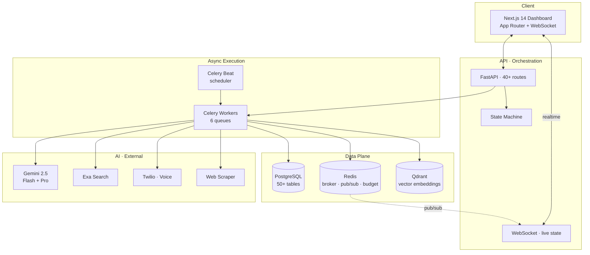
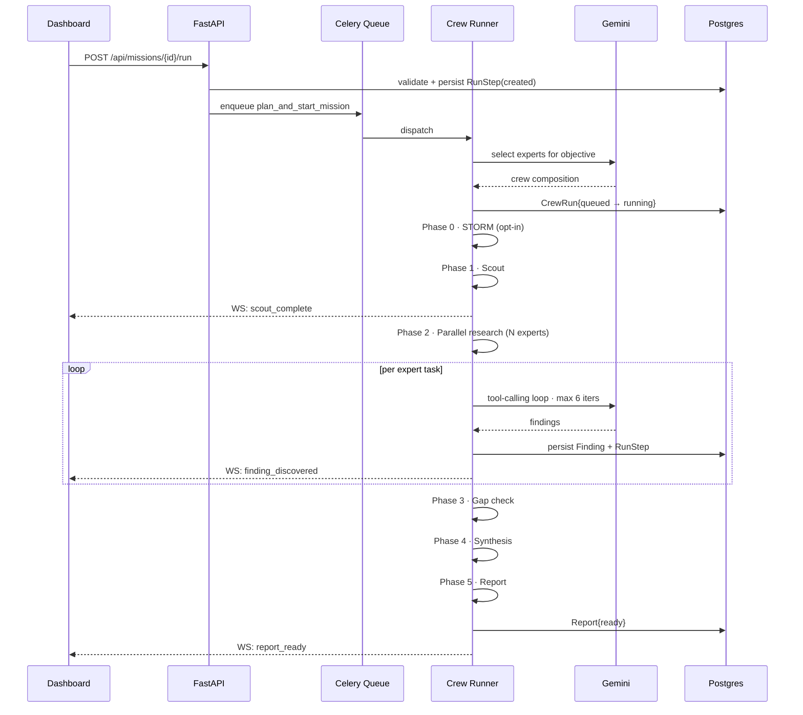
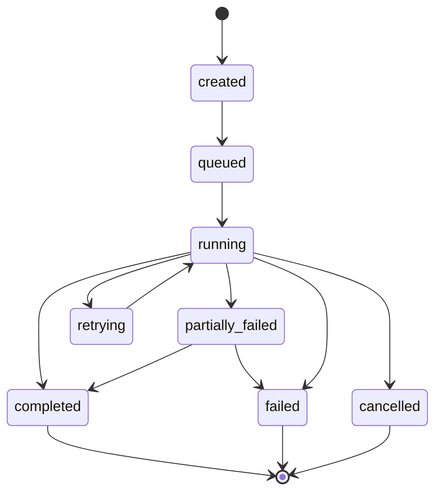

<div align="center">



<br/>

[](https://python.org)
[](https://typescriptlang.org)
[](https://nextjs.org)
[](https://fastapi.tiangolo.com)
[](https://postgresql.org)
[](https://redis.io)
[](https://docs.celeryq.dev)
[](https://qdrant.tech)
[](https://ai.google.dev)
[](LICENSE)

**Give Agentary an objective. It scouts the landscape, deep-dives every angle in parallel, audits its own gaps, and delivers a structured, cited report — all autonomously.**

[Overview](#-overview) · [Capabilities](#-capabilities) · [Pipeline](#-research-pipeline) · [Pre-Writing](#-pre-writing--storm) · [Agents](#-expert-agent-system) · [Architecture](#-system-architecture) · [Quick Start](#-quick-start)

</div>

---

## 🎯 Overview

Agentary is a full-stack platform for **autonomous research operations**. Describe an objective — _"map the EV charging competitive landscape"_ — and the system handles mission planning, multi-source collection, quality auditing, synthesis, and report delivery. Every micro-action streams to a live dashboard.

### What it does

- **Decomposes** a research objective into an expert-agent execution plan
- **Collects in parallel** — neural web search, page scraping, voice calls, Python analysis
- **Scores and attributes** every finding with confidence and source provenance
- **Layers intelligence** — signals, insights, recommendations, actions
- **Produces cited reports** — Markdown / HTML / PDF with per-section citations and inline charts
- **Streams state** to a live dashboard via WebSocket for full observability

### Typical use cases

Market intelligence · competitor monitoring · due diligence · lead research · local business data collection · technology landscape scans.

---

## ✨ Capabilities

<div align="center">

</div>

---

## 🧭 Research Pipeline

Every mission executes through a structured pipeline inspired by [DeerFlow](https://github.com/bytedance/deer-flow), with an opt-in [STORM](https://github.com/stanford-oval/storm) pre-writing stage. The goal: replace single-pass _"search → write"_ loops with explicit dimension mapping, parallel investigation, gap auditing, and grounded synthesis.

<div align="center">

</div>

### Phase 1 — Scout

A single expert maps the research landscape before any deep investigation. Surveys the topic, identifies dimensions, stakeholders, and sources worth investigating, and produces a structured dimension list for Phase 2. Without scouting, parallel experts dive into whichever angle comes back first from the initial search; the scout forces explicit coverage planning.

### Phase 2 — Parallel Research

Multiple expert agents execute in parallel, one per dimension from Phase 1. Every task targets **six explicit information categories** — the coverage contract a research phase must honor:

| Category | What to find | Example |
|---|---|---|
| 🧮 **Facts & Data** | Statistics, numbers, market sizes, dates | "Series B raised $45M at $200M valuation" |
| 🏗️ **Examples & Cases** | Real-world implementations, incidents | "Stripe deployed this in Q3, cutting fraud 40%" |
| 🧑‍🔬 **Expert Opinions** | Analyst perspectives, official statements | "Gartner places this in the Trough of Disillusionment" |
| 📈 **Trends & Predictions** | Forward-looking analysis, forecasts | "Market expected to reach $12B by 2028 (CAGR 23%)" |
| ⚖️ **Comparisons** | Alternatives, competitive context | "Unlike Competitor X which uses A, this uses B" |
| ⚠️ **Challenges & Criticisms** | Risks, limitations, opposing views | "Critics note accuracy drops below 60% on edge cases" |

Each expert runs an **agentic tool-calling loop** (up to 6 iterations) powered by Gemini, using `exa_search`, `gemini_search`, `web_scraper`, `python_executor`, `chart_generator`, and `voice_caller`.

<div align="center">

</div>

### Phase 3 — Gap Check

After research completes, a synthesizer agent audits findings against the six diversity categories, flags under-covered dimensions, and writes gap-notes back into mission state. Quality control against over-indexing on whichever angle was easiest to find.

### Phase 4 — Synthesis

The synthesizer receives all findings (including gap-check output), resolves contradictions between sources, weights claims by confidence and source authority, identifies cross-dimension patterns, and produces an overall assessment with explicit confidence levels.

### Phase 5 — Report

The report writer generates a structured output from the synthesized assessment — executive summary, detailed sections, inline charts, source citations, confidence indicators. Exports to Markdown / HTML / PDF; share tokens enable external distribution.

---

## 🪴 Pre-Writing — STORM

The research pipeline above produces good _breadth_. To lift _report quality_ — better structure, section-level citations, less _big-pile-of-sources_ feeling — Agentary adds an opt-in pre-writing stage inspired by Stanford's [STORM](https://github.com/stanford-oval/storm) methodology (Shao et al., NAACL 2024).

STORM runs as **Phase 0**: before Scout, the system plans the report outline with stakeholder perspectives, research questions, and section scopes. Findings discovered later in Phase 2 are bound back to those sections, so every section cites the specific evidence that supports it — instead of ending with one undifferentiated `sources: [...]` array.



Enable per-mission (`missions.storm_enabled=true`) or globally (`AGENTARY_STORM_ENABLED=true`).

### The six STORM steps

| # | Step | Model | What it does |
|---|---|---|---|
| 1 | **Perspective Mining** | Flash · 1 | Discovers up to four stakeholder viewpoints (regulator, beneficiary, insider, skeptic). Diversity enforced structurally — focus-sentence embeddings must cosine < 0.85. |
| 2 | **Question Generation** | Flash · N | One call per perspective → up to three research questions, each tagged priority + evidence type. |
| 3 | **Outline Planning** | Flash · 1 | Single call consumes perspective × question matrix, plans ≤6 sections with `scope`, `source_question_ids`, `expected_evidence_types`. |
| 4 | **Evidence Binding** | (pure) | After Phase 2, each section's scope is embedded and top-K findings (≥0.55 cosine) are bound. Sections with zero bound findings are flagged `partial_evidence=true`. |
| 5 | **Section Synthesis** | Pro · M | One Pro call per section. Prompt supplies only bound findings; citations array must match the bound set exactly — hallucinated ids rejected post-parse. |
| 6 | **Bounded Refinement** | Pro · ≤2 | Structural scoring (citation density, evidence coverage, min length) → rewrite weakest sections. Hard cap on refinement calls. |

### Section-level citation grounding

Citations are persisted as structural rows, not prompt-promise markup. The `section_citations` table stores `(report_id, section_index, finding_id, quote_span, confidence)` — so _"show me the evidence for section 3 of report X"_ is a plain `SELECT`:

```sql
SELECT s.section_index, f.source_url, s.quote_span, s.confidence
FROM section_citations s
JOIN findings f ON s.finding_id = f.id
WHERE s.report_id = :report_id
ORDER BY s.section_index, s.confidence DESC;
```

### Gemini budget discipline

STORM's canonical fan-out can easily hit 40+ calls per mission. Agentary caps spend at **14 calls per report** via a Redis-backed counter (`services/storm/budget.py`):

| Stage | Model | Max calls |
|---|---|---:|
| Perspective mining | Flash | 1 |
| Question generation | Flash | N (≤4) |
| Outline planning | Flash | 1 |
| Section synthesis | Pro | M (≤6) |
| Refinement | Pro | ≤2 |
| **Total** | | **6 Flash + 8 Pro = 14** |

Budget breach raises `StormBudgetExceeded`; the runner silently falls back to the baseline synthesizer, logs the reason to the `storm_runs` telemetry table, and the mission still completes.

### STORM vs baseline

| Aspect | Baseline (DeerFlow only) | With STORM |
|---|---|---|
| Phase count | 5 | 6 (pre-write added) |
| Report outline | Derived after the fact | Planned before retrieval |
| Perspective coverage | Expert specialties | Mined stakeholder viewpoints |
| Citation binding | Global `sources[]` array | Per-section `SectionCitation` rows |
| Quality gate | None post-synthesis | Structural metrics + bounded refinement |
| Citation validation | Prompt convention | Post-parse `finding_id` check |
| Gemini spend | 1 call per mission | 6 Flash + ≤8 Pro per mission |

---

## 🧑‍🚀 Expert Agent System

Agentary ships with **10 built-in expert agents**. Each declares a specialty, a system prompt, a tool allow-list, and a model configuration. Experts are selected per-mission by Gemini based on the objective; custom experts register via the API.

| Expert | Specialty | Tools | Role |
|---|---|---|---|
| 🔍 **Web Researcher** | `web_researcher` | exa_search · gemini_search · web_scraper | Scout + Research |
| 📦 **Data Extractor** | `data_extractor` | exa_search · web_scraper · python_executor | Research |
| 📊 **Market Analyst** | `market_analyst` | gemini_search · exa_search · python_executor | Research |
| 💰 **Financial Analyst** | `financial_analyst` | gemini_search · python_executor | Research |
| 🎯 **Competitive Intel** | `competitive_intel` | exa_search · gemini_search · web_scraper | Scout + Research |
| 🔬 **Due Diligence** | `due_diligence` | exa_search · gemini_search | Research |
| 📍 **Local Business Intel** | `local_business_intel` | exa_search · web_scraper · voice_caller | Research |
| 📞 **Voice Caller** | `voice_caller` | voice_caller | Research (phone extraction) |
| 🧩 **Synthesizer** | `synthesizer` | — (reasoning only) | Gap Check + Synthesis |
| ✍️ **Report Writer** | `report_writer` | chart_generator · python_executor | Report |

---

## 🏗️ System Architecture

Four layers. A Next.js dashboard talks to a FastAPI orchestration layer, which dispatches work to Celery workers backed by PostgreSQL, Redis, and Qdrant.



### Mission lifecycle



### Run status state machine



Every transition is persisted with timestamp and reason. Idempotency keys prevent duplicate execution. Failure categories (`transient`, `model_error`, `rate_limited`, `timeout`, `validation`, `internal`) drive targeted retry logic.

### Core orchestration services

| Service | Path | Responsibility |
|---|---|---|
| **Crew Runner** | `services/crews/crew_runner.py` | 5-phase execution engine |
| **Crew Service** | `services/crews/crew_service.py` | Crew assembly + expert selection |
| **Task Planner** | `services/crews/task_planner.py` | Gemini-powered decomposition |
| **Expert Registry** | `services/crews/expert_registry.py` | 10 built-in specialist agents |
| **Tool Registry** | `services/crews/tool_registry.py` | Agentic tool dispatch |
| **Research Engine** | `services/research/engine.py` | Deep research flow |
| **Report Generator** | `services/reports/report_generator.py` | MD / HTML / PDF synthesis |
| **Signal Service** | `services/intelligence/signal_service.py` | Signal detection + tracking |
| **Insight Generator** | `services/intelligence/insight_generator.py` | LLM-driven insight synthesis |
| **Workflow Engine** | `services/workflow/service.py` | DAG-based workflow execution |
| **State Machine** | `services/state_machine.py` | Run lifecycle + transition validation |
| **Monitor Service** | `services/monitor_service.py` | Scheduled re-runs + change detection |

---

## 🔭 Observability

Every micro-action during execution is recorded as a `RunStep` row:

| Step type | Recorded when |
|---|---|
| `expert_task` | Expert begins / completes a task |
| `tool_call` | Tool executed, with input / output |
| `searching` | Scout-phase exploration |
| `analyzing` | Gap-check audit |
| `synthesis` | Synthesis-phase merge |
| `writing` | Report generation |
| `error` | Any failure during execution |

RunSteps carry correlation IDs, parent-child relationships, token counts, duration, and truncated I/O summaries. **Full execution replay is possible from the DB alone** — no ephemeral state.

---

## 🗂️ Data Model

```
Project (scoping container)
  └── Mission (research task)
        ├── AgentCrew (selected experts)
        ├── ResearchOutline (STORM pre-write, optional)
        │     └── SectionCitation (per-section evidence binding)
        ├── MissionRun (execution instance)
        │     ├── CrewTask (per-expert task)
        │     │     └── RunStep (micro-action trace)
        │     └── CrewRun (crew execution record)
        ├── Finding (discovered data point)
        └── Report (synthesized output)

Intelligence pipeline
  Finding ──> Signal ──> Insight ──> Recommendation ──> Action
```

### Key enums

| Enum | Values |
|---|---|
| **MissionType** | research · voice_extraction · monitoring · data_collection · competitive_analysis · custom |
| **CoordinationStrategy** | parallel · sequential · hierarchical |
| **FindingType** | fact · data_point · insight · quote · statistic · contact_info · price · trend · anomaly · opportunity · risk |
| **RunStatus** | created · queued · running · awaiting_input · retrying · partially_failed · completed · failed · cancelled |

---

## 🛠️ Technology Stack

| Layer | Technology |
|---|---|
| **Frontend** | Next.js 14 · TypeScript 5 · Tailwind CSS · WebSocket live state |
| **API** | FastAPI 0.115 · Pydantic v2 · 40+ route modules |
| **Async Execution** | Celery 5 · 6 queues + Beat scheduler · Redis broker |
| **Primary DB** | PostgreSQL 16 · SQLAlchemy · Alembic (50+ tables) |
| **Vector Store** | Qdrant (finding + outline-scope embeddings) |
| **Cache / Pub-Sub** | Redis 7 (WebSocket events · STORM budget · runtime state) |
| **LLM — reasoning** | Gemini 2.5 Flash (extraction · tool-calling · outline planning) |
| **LLM — synthesis** | Gemini 2.5 Pro (section synthesis · refinement) |
| **Grounding** | Gemini Grounding · Exa neural search |
| **Web** | Custom scraper (HTTP + HTML parse) |
| **Voice** | Twilio (outbound calls + transcript capture) |
| **Email** | Resend |
| **Container** | Docker + docker-compose (db · redis · qdrant · backend · dashboard · nginx) |

---

## 🚀 Quick Start

### Prerequisites

- Python 3.13+
- Node.js 18+
- Docker + Docker Compose

```bash
git clone https://github.com/madhavcodez/agentary.git
cd agentary

# 1. Infrastructure
docker compose up -d db redis qdrant

# 2. Backend
cd backend
python -m venv .venv
# Windows
.venv\Scripts\activate
# macOS / Linux
# source .venv/bin/activate
pip install -r requirements.txt
alembic upgrade head
uvicorn app.main:app --host 0.0.0.0 --port 8000 --reload

# 3. Celery workers (new terminal)
celery -A app.celery_app worker --loglevel=info \
  --queues=research,missions,voice,monitors,reports,workflows
celery -A app.celery_app beat --loglevel=info

# 4. Frontend (new terminal)
cd ../dashboard
npm install
npm run dev
```

- Dashboard → http://localhost:3000
- API docs → http://localhost:8000/docs

---

## 🔐 Environment Variables

| Variable | Required | Purpose |
|---|:---:|---|
| `GEMINI_API_KEY` | ✓ | Core LLM (reasoning · tool-calling · synthesis) |
| `DATABASE_URL` | ✓ | PostgreSQL connection string |
| `REDIS_URL` | ✓ | Celery broker + pub/sub |
| `QDRANT_URL` | ✓ | Vector search backend |
| `EXA_API_KEY` | | Exa neural web search and contact discovery |
| `TWILIO_ACCOUNT_SID` | | Outbound voice calling |
| `TWILIO_AUTH_TOKEN` | | Voice call authentication |
| `TWILIO_FROM_NUMBER` | | Voice caller ID |
| `RESEND_API_KEY` | | Email delivery |
| `AGENTARY_STORM_ENABLED` | | Globally enable STORM pre-writing (default: `false`) |
| `STORM_MAX_PERSPECTIVES` | | Max stakeholder perspectives (default: 4) |
| `STORM_MAX_QUESTIONS` | | Max questions per perspective (default: 3) |
| `STORM_MAX_SECTIONS` | | Max outline sections (default: 6) |
| `STORM_MAX_REFINEMENT` | | Max refinement passes per report (default: 2) |
| `STORM_EVIDENCE_THRESHOLD` | | Min cosine similarity for evidence binding (default: 0.55) |

---

## 📁 Project Structure

```
agentary/
├── backend/
│   ├── app/
│   │   ├── api/              # 40+ FastAPI route modules
│   │   ├── models/           # 50+ SQLAlchemy ORM models
│   │   ├── schemas/          # Pydantic request/response schemas
│   │   ├── services/
│   │   │   ├── crews/        # 5-phase execution engine
│   │   │   │   ├── crew_runner.py      # Phase orchestrator
│   │   │   │   ├── crew_service.py     # Crew assembly
│   │   │   │   ├── task_planner.py     # Gemini decomposition
│   │   │   │   ├── expert_registry.py  # 10 built-in experts
│   │   │   │   └── tool_registry.py    # Agentic tool dispatch
│   │   │   ├── storm/        # Pre-writing stage (Phase 0)
│   │   │   │   ├── perspective_miner.py
│   │   │   │   ├── question_generator.py
│   │   │   │   ├── outline_planner.py
│   │   │   │   ├── evidence_binder.py
│   │   │   │   ├── section_synthesizer.py
│   │   │   │   ├── refinement.py
│   │   │   │   ├── budget.py
│   │   │   │   └── telemetry.py
│   │   │   ├── research/     # Deep research engine (Gemini + Exa)
│   │   │   ├── intelligence/ # Signals · insights · recommendations
│   │   │   ├── reports/      # Report generation + export
│   │   │   ├── workflow/     # DAG-based workflow execution
│   │   │   ├── voice/        # Voice call orchestration
│   │   │   ├── monitors/     # Scheduled re-runs + change detection
│   │   │   └── state_machine.py
│   │   ├── tasks/            # Celery async tasks (6 queues)
│   │   ├── core/             # Logging · events · rate limits · WS
│   │   ├── providers/        # LLM provider integrations
│   │   └── prompts/          # System prompts for expert agents
│   ├── alembic/              # Database migrations
│   └── tests/                # pytest test suite
├── dashboard/
│   ├── app/                  # Next.js 14 App Router
│   ├── components/           # Reusable UI components
│   └── lib/                  # API client · types · hooks
├── docker-compose.yml
├── nginx.conf
└── README.md
```

---

## 🎨 Design language

Dark, editorial, intelligence-room. Not _dashboard-by-numbers_.

| Token | Value |
|---|---|
| Base background | `#0d1017` |
| Card surface | `#131820` |
| Card hover | `#181e28` |
| Subtle border | `rgba(255, 255, 255, 0.06)` |
| Default border | `rgba(255, 255, 255, 0.08)` |
| Hover border | `rgba(255, 255, 255, 0.12)` |
| Primary text | `#FFFFFF` / `gray-100` |
| Secondary text | `#C7CAD1` |
| Muted text | `#8A93A4` |
| Agent accent | `#A78BFA` (violet) |
| Research accent | `#06B6D4` (cyan) |
| Finding accent | `#F59E0B` (amber) |
| Success accent | `#34D399` (emerald) |
| Body font | Inter |
| Editorial font | Lora (serif · report headings) |
| Mono font | JetBrains Mono / SF Mono (data · code) |

---

<div align="center">

**MIT License** · Built by [**@madhavcodez**](https://github.com/madhavcodez)

_Give it an objective. Watch the crew deliver._

</div>
