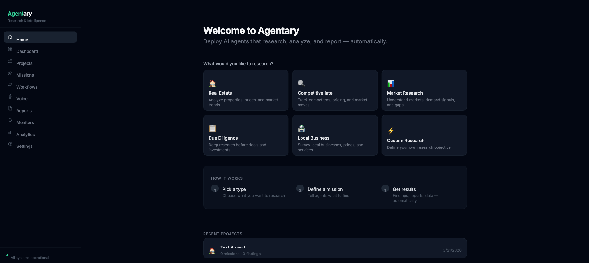

<div align="center">

# AGENTARY

### Autonomous AI Research & Intelligence Platform

[](https://python.org)
[](https://typescriptlang.org)
[](https://nextjs.org)
[](https://fastapi.tiangolo.com)
[](https://ai.google.dev)
[](LICENSE)

**Deploy expert AI agent crews that research any domain, call businesses, analyze data, and generate reports — automatically.**

[Quick Start](#quick-start) · [How It Works](#how-it-works) · [Features](#feature-catalog) · [Architecture](#architecture) · [API](#api-highlights)

</div>

---

## Product Tour

<p align="center">
  
</p>

<p align="center">
  <strong>Mission Pipeline</strong><br/>
  Create research missions with expert crews, then monitor execution from the live dashboard.
</p>

---

## How It Works

```
You define a mission objective
            |
            v
Gemini assembles the best expert crew
            |
            v
Experts execute tool-calling research tasks in parallel
            |
            v
Findings are scored, sourced, and structured
            |
            v
Intelligence layer generates signals, insights, and recommendations
            |
            v
Actions execute with policy-gated approvals
            |
            v
Reports, exports, and dashboards deliver results
```

---

## Feature Catalog

### Mission Execution
- Autonomous mission planning with dynamic expert crew selection
- Multi-phase run orchestration (research, synthesis, reporting)
- Real-time mission console with step-level visibility, durations, and token usage
- Structured findings with confidence scores and source attribution
- Start, stop, and rerun controls with idempotency guards

### Expert Agent System
8 built-in specialists auto-selected per mission: Web Researcher, Data Analyst, Market Analyst, Property Researcher, Local Scout, Voice Caller, Synthesizer, Report Writer. Each runs a tool-calling loop with access to web search, Python sandbox, chart generation, and voice calling.

### Intelligence Pipeline (Phase 2)
- **Signals**: Structured events emitted from crew execution and external sources
- **Insights**: AI-generated pattern analysis from aggregated findings
- **Recommendations**: Actionable next-steps with accept/reject inbox
- Confidence-scored evidence chains linking findings to insights

### Action System (Phase 3)
- 9 action handlers: merge entities, trigger workflows, send alerts, queue calls, generate reports, trigger monitors, create tasks, escalate, update status
- Policy engine with configurable rules (confidence thresholds, auto-approve, require-approval)
- Full audit trail with decision rationale and outcome recording
- Closed-loop feedback: action outcomes create new signals

### Voice Intelligence
- Outbound call campaigns via Twilio + Pipecat
- Transcript ingestion and structured entity extraction via Gemini
- Campaign orchestration with parallel contact processing

### Workflow Automation
- Visual DAG editor with ReactFlow (drag-and-drop nodes)
- Workflow templates and custom runs
- 27 node types with topological execution and validation

### Monitoring & Alerts
- Configurable monitors with change detection algorithms
- Scheduled checks every 5 minutes via APScheduler + Celery Beat
- Alert severity levels, acknowledgements, and unread counters

### Reporting & Export
- AI-generated narrative reports with charts and citations
- PDF export via WeasyPrint, plus CSV/JSON/Excel data exports
- Share links for external report delivery (no auth required)

### Entity Knowledge Graph
- Entity creation, deduplication, and merge with undo
- Entity aliases, relationships, and collections
- Semantic search via Qdrant vector embeddings

### Real-time & Observability
- WebSocket live event stream (`/ws/live-feed`) with Redis pub/sub bridge
- Run step observability model with durations and failure categories
- Circuit breaker status in health checks
- Structured JSON logging with correlation ID tracking

---

## Architecture

```
Dashboard (Next.js 14 + TypeScript + TailwindCSS)
  |-- 28 page routes: missions, projects, workflows, reports,
  |   monitors, voice, signals, recommendations, approvals,
  |   actions, entities, analytics, operator, settings
  |-- Real-time via WebSocket + REST hydration
  |-- Grouped sidebar navigation (Overview, Execution, Intelligence, System)
            |
            v
API Layer (FastAPI — 100+ endpoints across 40+ routers)
  |-- Mission orchestration + crew execution
  |-- Workflow engine (DAG execution with topological sort)
  |-- Voice pipeline (Twilio + Pipecat + Gemini extraction)
  |-- Intelligence layer (signals → insights → recommendations → actions)
  |-- Reporting services (narrative + charts + PDF)
  |-- Monitoring + alerts
            |
            v
Execution + Infrastructure
  |-- Gemini 2.5 Flash (generation + tool calling)
  |-- PostgreSQL (45 models, 15+ migrations)
  |-- Redis (Celery broker + pub/sub + circuit breakers)
  |-- Qdrant (vector search over findings, transcripts, entities)
  |-- Celery workers (8 task queues: research, missions, voice,
  |   monitors, reports, workflows, signals, actions)
  |-- APScheduler (recurring monitor checks, insight staleness)
```

---

## API Highlights

| Method | Endpoint | Purpose |
|---|---|---|
| `POST` | `/api/missions` | Create mission |
| `POST` | `/api/missions/{id}/start` | Start mission execution |
| `GET` | `/api/missions/{id}` | Mission status + details |
| `GET` | `/api/findings` | Structured findings |
| `POST` | `/api/workflows/{id}/run` | Trigger workflow |
| `POST` | `/api/recommendations/{id}/accept` | Accept recommendation |
| `POST` | `/api/actions` | Create action request |
| `PUT` | `/api/actions/{id}/approve` | Approve pending action |
| `POST` | `/reports` | Generate report |
| `GET` | `/reports/{id}/pdf` | Export PDF |
| `POST` | `/reports/{id}/share` | Create share link |
| `WS` | `/ws/live-feed` | Real-time event stream |
| `GET` | `/health` | Service + breaker health |

Full API docs available at `http://localhost:8000/docs` (Swagger UI).

---

## Recent Revamp (v2)

### UI/UX Improvements
- **Unified color system**: Consistent emerald primary across all components (buttons, badges, stats, accents) — eliminated indigo/emerald mismatch
- **Grouped navigation**: Sidebar now organized into logical sections (Overview, Execution, Intelligence, System) with section headers for faster navigation
- **Responsive grids**: Dashboard, stats bar, and content grids now properly handle mobile/tablet/desktop breakpoints (`grid-cols-1 md:grid-cols-2 lg:grid-cols-3`)
- **Typography consistency**: Standardized heading weights (`font-bold`) and description sizing across all pages
- **Accessibility**: Added ARIA labels to nav links, status indicators, approval badges, and form inputs. Semantic `aria-current="page"` on active nav items.

### Error Handling
- **Frontend**: Replaced silent `catch {}` blocks with visible error states and retry actions. Project load failures now show inline error with retry button. Creation failures show toast notifications.
- **Backend**: Eliminated bare `except Exception: pass` patterns across health checks, mission orchestration, and Celery fallback paths. All exceptions now logged with context (service name, run ID, error type).

### Code Quality
- **ESLint**: Re-enabled `@typescript-eslint/no-explicit-any` as warning (was disabled entirely)
- **Logging**: Added structured logging to mission API routes and health check background loop
- **Gitignore**: Added Celery schedule files to prevent accidental commits

---

## Quick Start

### Prerequisites
- Python 3.13+
- Node.js 18+
- Docker

```bash
git clone https://github.com/madhavcodez/agentary.git
cd agentary

# Infrastructure
docker compose up -d db redis qdrant

# Backend
cd backend
python -m venv .venv
# Windows:
.venv\Scripts\activate
# macOS/Linux:
# source .venv/bin/activate
pip install -r requirements.txt
alembic upgrade head
uvicorn app.main:app --host 0.0.0.0 --port 8000 --reload

# Frontend (new terminal)
cd ../dashboard
npm install
npm run dev
```

Open `http://localhost:3000`.

---

## Environment Variables

| Variable | Required | Purpose |
|---|:---:|---|
| `GEMINI_API_KEY` | Yes | Core LLM + tool calling |
| `DATABASE_URL` | Yes | PostgreSQL connection |
| `REDIS_URL` | Yes | Queue + pub/sub |
| `QDRANT_URL` | Yes | Vector search backend |
| `EXA_API_KEY` | Optional | Exa semantic web search |
| `TWILIO_ACCOUNT_SID` | Optional | Voice calling |
| `TWILIO_AUTH_TOKEN` | Optional | Voice calling |
| `TWILIO_FROM_NUMBER` | Optional | Voice calling |
| `RESEND_API_KEY` | Optional | Email notifications |

---

## Project Structure

```
agentary/
├── backend/
│   ├── app/
│   │   ├── api/          # 40+ FastAPI routers
│   │   ├── models/       # 45 SQLAlchemy models
│   │   ├── schemas/      # Pydantic request/response schemas
│   │   ├── services/     # Business logic (crews, intelligence, voice, reports)
│   │   ├── tasks/        # Celery async tasks
│   │   ├── core/         # Logging, events, permissions, WebSocket
│   │   └── providers/    # LLM provider integrations
│   ├── alembic/          # Database migrations
│   └── tests/            # pytest test suite
├── dashboard/
│   ├── app/              # Next.js 14 App Router (28 routes)
│   ├── components/       # Reusable UI components
│   └── lib/              # API client, types, hooks
├── docs/
├── docker-compose.yml
└── README.md
```

---

<div align="center">

**MIT License**

Built by [Madhav Chauhan](https://github.com/madhavcodez)

</div>
